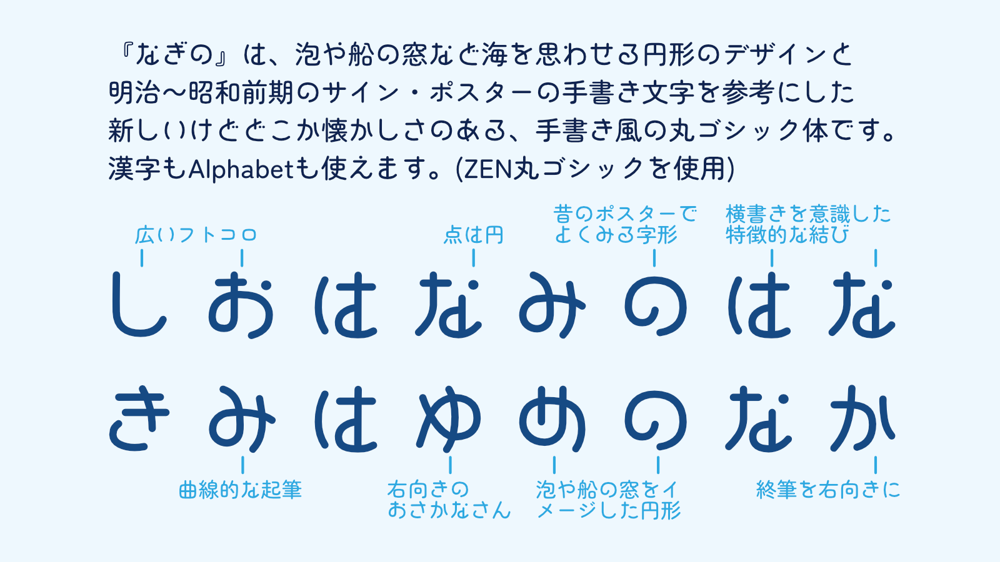
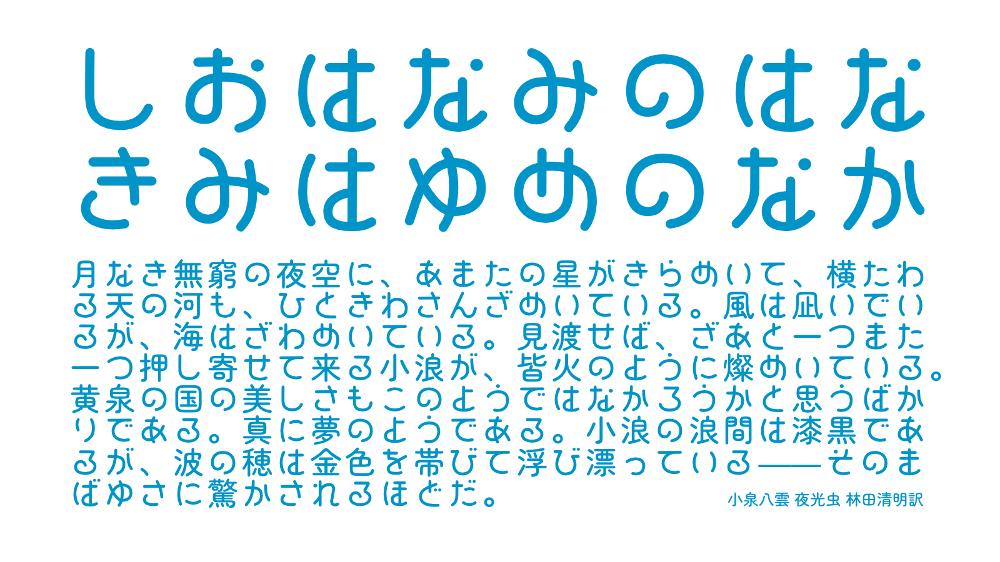
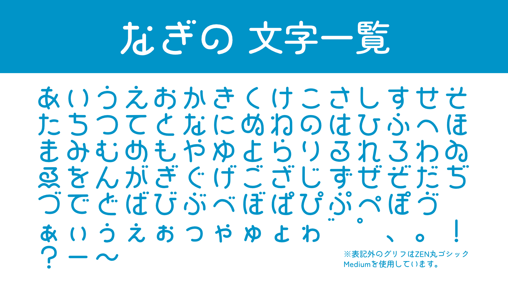
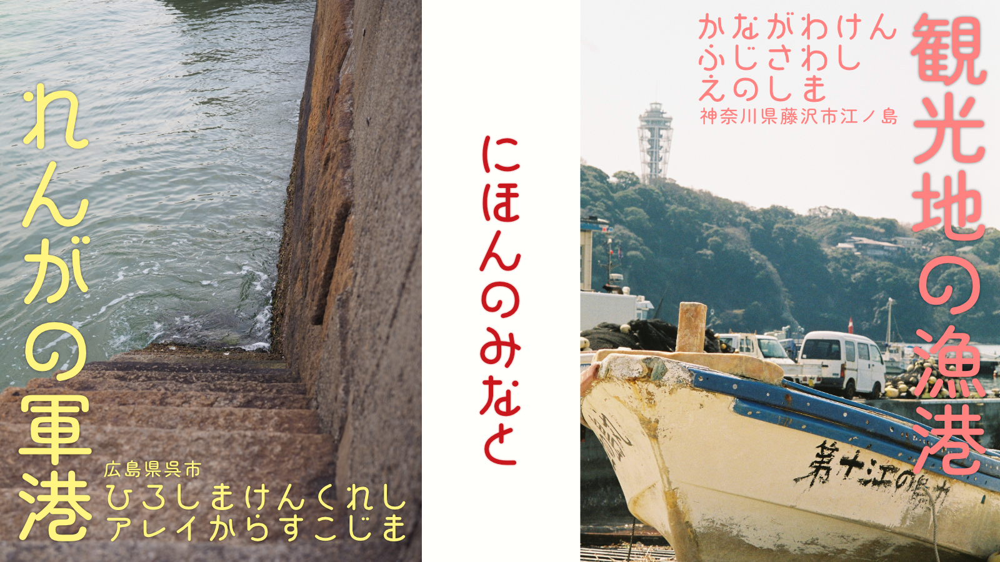
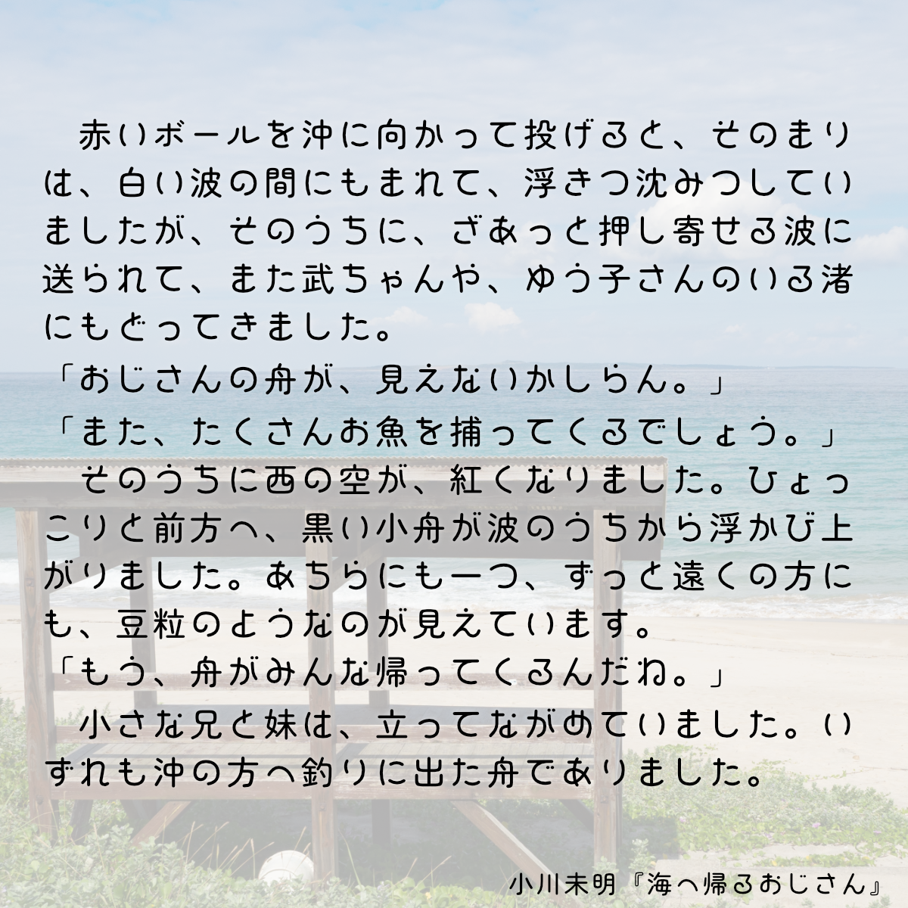
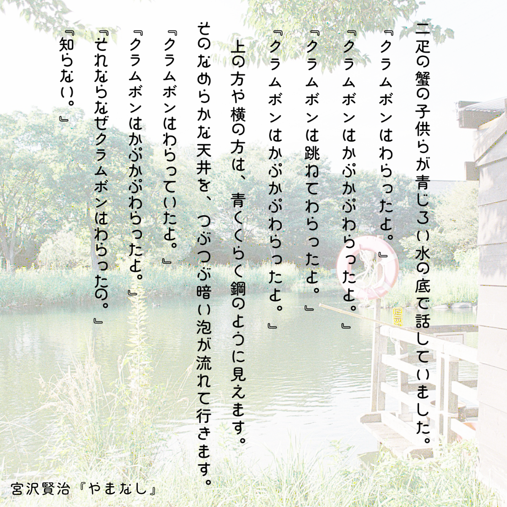

# なぎの

## フォントについて

- 泡や船の窓など海を思わせる円形のデザインと、明治～昭和前期のサイン・ポスターの手書き文字を参考にした、ユニークでどこか懐かしさのある、手書き風の丸ゴシック体です。
- このフォントはZEN丸ゴシックのグリフに置き換えて作成しました。下記の収録字種が『なぎの』独自のグリフです。
- ライセンスはSIL Open Font License Version 1.1を適用しています。どのような用途にも使用OKです。もちろん商用もOKです。詳細はライセンス文章を確認してください。

## ライセンス

[SIL Open Font License Version 1.1](https://scripts.sil.org/cms/scripts/page.php?site_id=nrsi&id=OFL_web)

## 収録字種

、。ぁあぃいぅうぇえぉおかがきぎくぐけげこごさざしじすずせぜそぞただちぢっつづてでとどなにぬねのはばぱひびぴふぶぷへべぺほぼぽまみむめもゃやゅゆょよらりるれろゎわゐゑをんゔ゛゜・ー！？

上記以外の文字種（アルファベット、カタカナ、漢字ほか）はZEN丸ゴシックを使用しています。

## 改変元のフォント

- [ZEN丸ゴシック Medium](https://fonts.google.com/specimen/Zen+Maru+Gothic)

## 注意事項

- ライセンスは改変元のフォントに従います。
- 本フォントを利用したことによって発生したいかなる故障・損害についても責任を負いません。
- 使用報告をいただけると作者が喜びます。また書籍やwebの記事などで当フォントを紹介する際は、メールまたはツイッターで報告をしていただければ幸いです。

## 使用例

## 作者

- あまずさ鴒 (Amazusa Rei)
  - E-Mail: amazusa0@gmail.com
  - Twitter: @AmazusaRei
  - GitHub: https://github.com/amazusa

## 更新履歴

- 2023/08/17  なぎの ver1.0 公開
